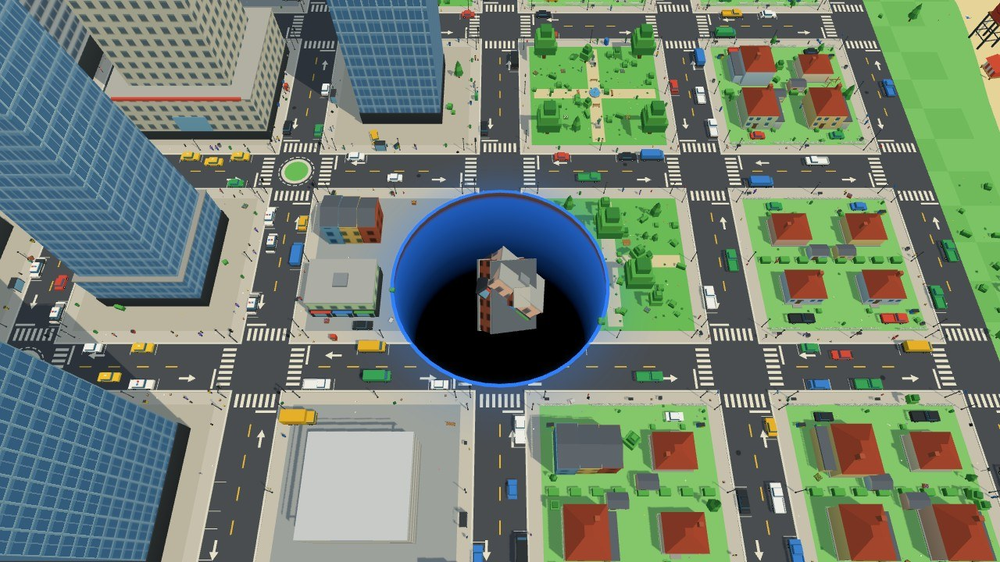
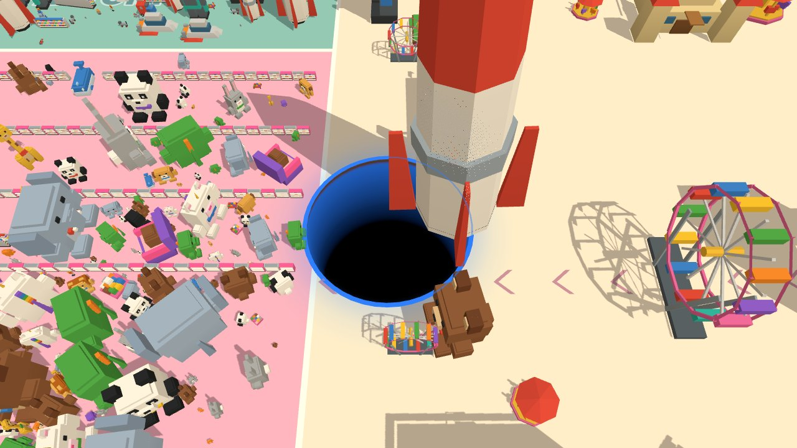

# Mini Game Portal

A small collection of browser games that I built to get familiar with [three.js](https://threejs.org/).
It is an educational, just-for-fun project: no commercial goal, no accounts, no ads. Large parts of the code were
written together with AI coding agents under my direction, and everything is kept readable so it can be studied,
played and modified locally.

**Play it in the browser: [games.deni.io](https://games.deni.io)**

| Game                             | What it is                                                                                                |
| -------------------------------- | --------------------------------------------------------------------------------------------------------- |
| [Gravel Rally](src/games/rally/) | Point-to-point rally on real-world roads (OpenStreetMap + elevation data), custom raycast-vehicle physics |
| [Hole Island](src/games/hole/)   | Touch-first "swallow everything" game on a blocky toy city and a giant toy store                          |

[](src/games/rally/)

|                                                                                               |                                                                                               |
| --------------------------------------------------------------------------------------------- | --------------------------------------------------------------------------------------------- |
|  |  |
|                          |                          |

## What is in here

- **three.js** scenes, instancing / LOD / streaming terrain, procedural assets, seeded generators.
- A hand-written **vehicle physics** model (raycast suspension, combined-slip tyres, drivetrain) that runs in plain
  node, so it is covered by regression tests.
- A **real-world map baker** (Python) that turns open data into playable stages.
- Small tool pages (map viewer, car viewer, asset / item viewers, balance charts) used while building the games.
- Bundled with [Rsbuild](https://rsbuild.rs/), tested with Rstest, written in TypeScript.

## Quick start

```bash
npm install
npm run dev        # http://localhost:3000
npm run test       # unit + data tests (fast); `npm run test:integration` = playtests (slow), see `integration-tests/README.md`
npm run lint
npm run build      # dist/ (portal + one self-contained folder per game)
npm run build -- --environment rally   # rebuild only dist/games/rally/
```

Games are discovered automatically from `src/games/<id>/game.json`. Folder layout, the portal, deployment and other
project internals: [`DETAILS.md`](DETAILS.md).

## How it started

This was the very first prompt I gave the coding agent, and it built the portal and the first version of Gravel Rally
(physics, test map, map viewer, car viewer and asset debugger) from it. Everything since grew from there, one round of
feedback at a time. Try it with your own bots and see what you can build:

```text
Hey Clod let's start on bit more fun of a projects - mini game portal

Start simple the website should just have screen shot and links to minigames.
All mini games will be hosted in a separate folder so this is quick and easy for navigation.
All the games should be build using three.js unless otherwise specified.
Don't spend too much time on the portal - this should just help us navigate things quickly.

The first game that we want to start with is Rally Racing game.
The key component of good racing games are game physics and maps.
we will use realistic maps which we'll create later - for now add a very short map called test map that will allow us to test the physics - create a classic gravel rally.

As we'll be doing iterations on models and maps - please create map exterior view debugger page which will allow me ariel view and quickly view the map as a whole.
Then add a card view page - which will allow us to inspect and iterate on the car models.
And lastly add a asset debug page - which will allow us to quickly navigate all assets.
For quick navigation the car and asset page should also support URL routing to an object + seed, and also menu on left side on which we can toggle variables / models.

I'm not sure if we'll need a map editor yet so don't build that for now - probably we'll prompt here to edit maps.

go at it - let's make fun games!

Notes: as you iterate please create skills and update read me files and leave good trail that will allow us to make quick changes in the future - this will require a lot of iterations - as the Key to good game is rich content, and we are not doing that just yet.

The graphic quality that we aim for is late 2000s games, including lighting, terrain, dynamic asset loading for large maps etc., we got to make sure our game both looks decent but more importantly it's playable and doesn't lag. so use proper asset references when rendering objects.
```

## License

The source code, the procedurally generated assets, the documentation and the screenshots are licensed under the
[PolyForm Noncommercial License 1.0.0](LICENSE): you can read, run, modify and share them for any noncommercial
purpose (personal use, learning, hobby projects, research, education), but not for commercial purposes. The code is
source-available rather than OSI "open source".

Two things are **not** covered by that licence:

- the baked map data of the real maps (in `src/games/rally/maps/<id>/`: `data.json`, `route.json`, `horizon.json`,
  `junction*.json`, `buildings.csv`, `preview/stage-card.json` + its `.jpg` render) is derived from OpenStreetMap and other open
  datasets and stays under the [ODbL 1.0](https://opendatacommons.org/licenses/odbl/) with attribution, so it can be
  reused freely under those terms;
- third-party models and data keep their own licences, see [`THIRD-PARTY.md`](THIRD-PARTY.md).

## Credits and data

The maps are baked from open data (© OpenStreetMap contributors, ESA WorldCover, Copernicus DEM, USGS 3DEP, Microsoft
building footprints and road detections); some car bodies are converted from models shared by their authors. Every source, licence and
attribution is listed in [`THIRD-PARTY.md`](THIRD-PARTY.md) and in each map / car folder.

Car makes and models, brand names and real places are used for identification only. This is a non-commercial fan
project and is not affiliated with or endorsed by any manufacturer, team, company or agency.
