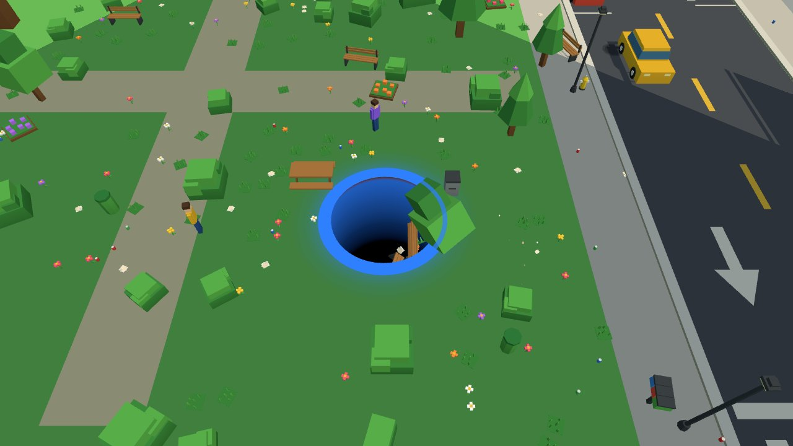
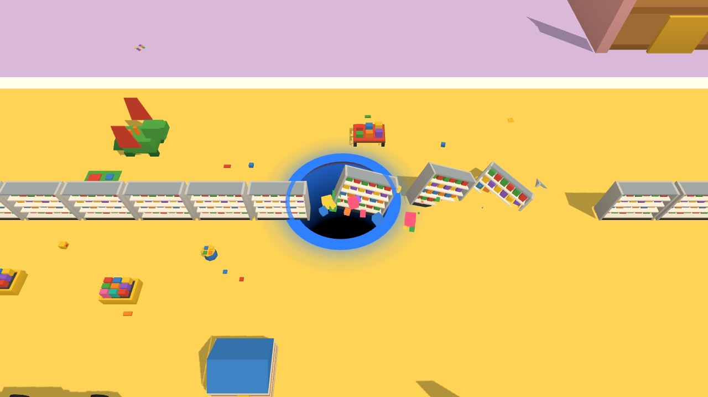
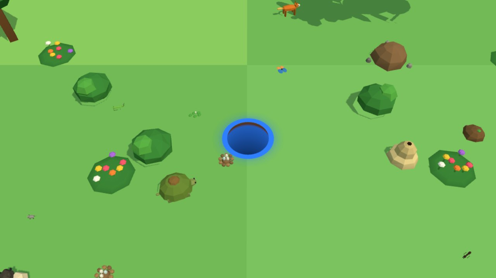
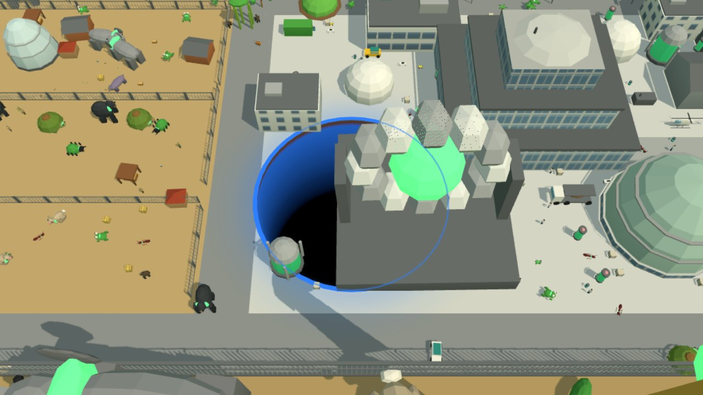

# Hole Island (working title)

A simple game in which you play the role of gravity hole eating the world around you, built with three.js to learn the
library. You steer a gravity hole around a blocky island and swallow everything that fits; every item you eat makes the hole
bigger, from trash cans and flowers up to skyscrapers. You play against the clock and the score goes on a top-10 list
per difficulty. It is a touch-first game (one finger steers), with keyboard and mouse for desktop testing.

All art is original, procedural and made from boxes, and the name is a placeholder.


## Play

```bash
npm run dev     # then open http://localhost:3000/games/hole/
```

Pick a difficulty and a hole colour, then drag to steer. Add `?map=toy` for the toy store or `?map=animal` for Animal Island.

## Maps

|                                                       |                                                      |
| ----------------------------------------------------- | ---------------------------------------------------- |
|             |            |
| **City Island** - a generated toy city, 83 item types | **Toy Emporium** - a giant toy store, 210 item types |


|                                                                                 |                                                          |
| ------------------------------------------------------------------------------- | -------------------------------------------------------- |
|                       |  |
| **Animal Island** - ants, rabbits and zebras first; 37 giant animals, 192 types | The secret zoo and laboratory, where the giants are made |

## Features

- Seeded map generators (districts, roads, parks, beach; Animal Island with biomes, rivers, hills and a secret zoo + lab) and hand-placed toy-store floor plans.
- **Animal Island** (third map, 190 item types): animals walk, hop, swim and flee, hills are edible, 37 giant animals made in a secret laboratory. Details in [`ANIMAL-ISLAND.md`](ANIMAL-ISLAND.md).
- Scripted falling / tipping (no physics engine), growth levels with a pulse and a camera that pulls back.
- Every item is built once as procedural geometry; all items of a material are one `BatchedMesh` (a few draw calls per frame for thousands of items).
- Menus, countdown, results and a top-10 list per difficulty, all usable by touch.
- Tool pages: item viewer, map viewer, balance charts with headless bot runs (dev server).

## Documentation

| Doc                            | Content                                                                                     |
| ------------------------------ | ------------------------------------------------------------------------------------------- |
| [`DETAILS.md`](DETAILS.md)     | rules, level / size tables, scoring, item catalog, map generator, debug tools, architecture |
| [`TOY-STORE.md`](TOY-STORE.md) | second map: design, asset roster, open tasks                                                |

Educational, non-commercial project; see the repository root for credits.
