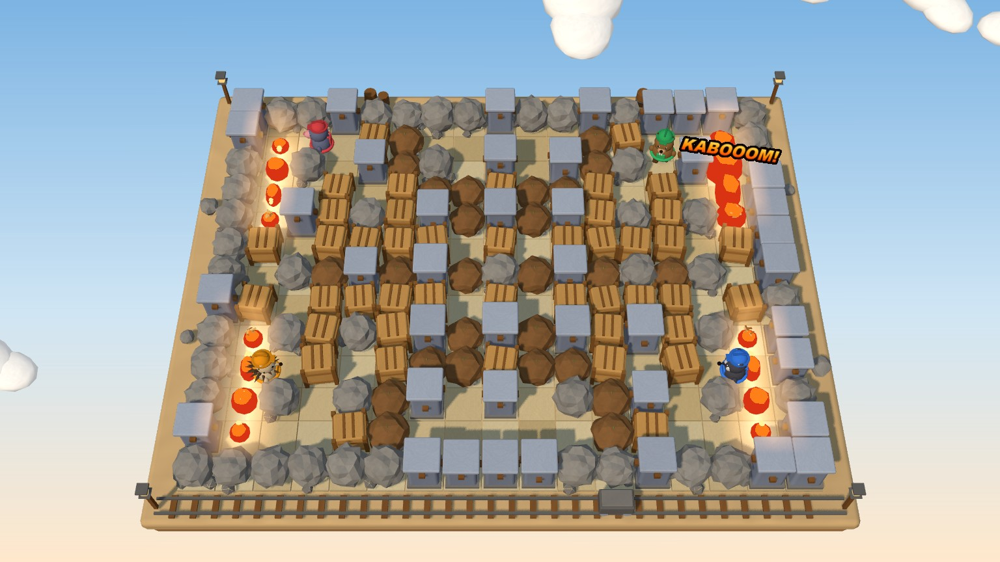
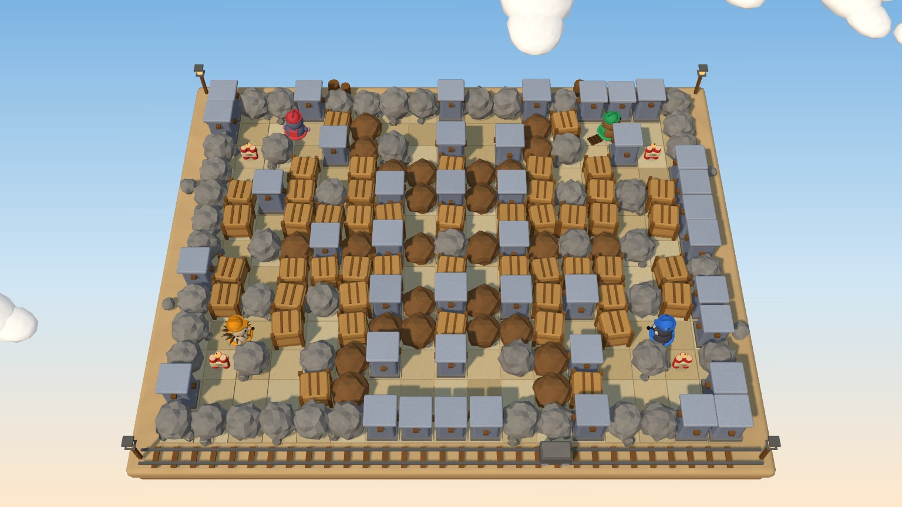
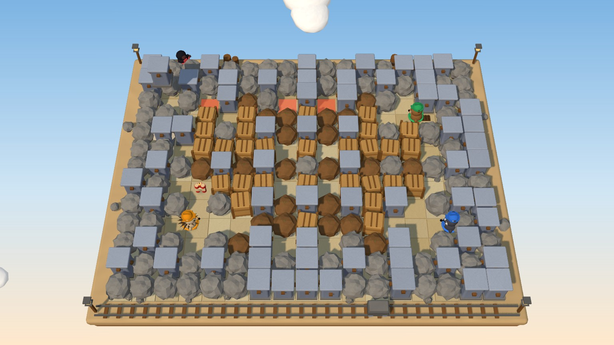
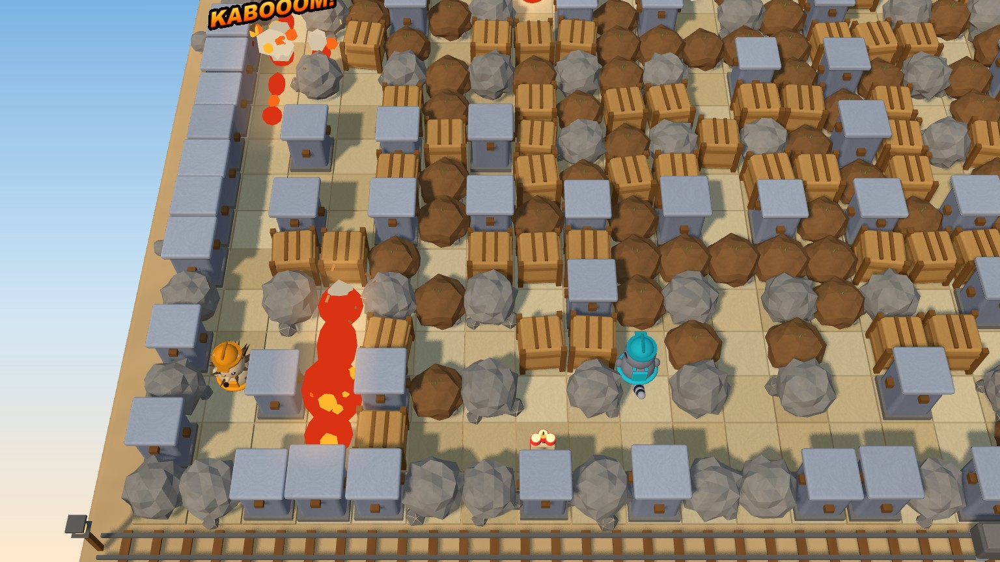

# 3, 2, 1 Kabooom

A party game for you and up to seven bots. A crew of chubby animal demolition workers is dropped onto a floating clay
diorama: light the fuse, watch the band count **3, 2, 1**, blast the crates and be the last critter standing. A tilted 3D
arena, three arena sizes, bots in three skill levels, and chain reactions that stay smooth.

> **In development.** Not listed on the portal in the release build (playable by its link); listed on the dev server and in test builds.



## Play

```bash
npm run dev      # then open http://localhost:3000/games/kaboom/
```

Pick your critter, the arena, how many bots (1-7), their skill and the number of rounds, then:

- **Move** with WASD / arrows (or drag a finger, or a gamepad stick); **drop TNT** with Space (or the TNT button).
- The band counts 3, 2, 1, then flames shoot out in a cross. Hard blocks stop them, crates break, other TNT goes off.
- Touch a flame and you are out. Last critter standing wins the round; late in a round the walls fall in from the edge.

Dev links: `?size=l&bots=5&difficulty=hard&rounds=3&critter=otter&seed=7`, `bot=1` (autopilot), `debug=1`, `mute=1`.

|                                                                    |                                                                   |
| ------------------------------------------------------------------ | ----------------------------------------------------------------- |
|                 |       |
| **Medium arena**: four critters, crates and boulders, a safe start | **Sudden death**: late in a round the walls fall in from the edge |



The Large arena (up to 8 players) is bigger than the screen: the camera follows you.

## Features

- **The Boom Crew**: Mole, Badger, Beaver, Hedgehog, Armadillo, Raccoon, Capybara and Otter, built from primitives and animated by code.
- **Arenas**: Small / Medium / Large from a seed, mirrored so every spawn is fair, with a proven safe start (room to drop the first TNT and hide).
- **Bots that come for you**: Easy ones mostly farm crates and only attack when you are close, Normal ones chase and corner you, Hard ones cut off your escape routes and aim where you are heading.
- **Smooth explosions**: pooled GPU particles, one flame mesh, a heat texture instead of lights, a static shadow map - a 40-TNT chain costs about as much as one blast.
- Touch, keyboard and gamepad; phone-friendly with a follow camera on big arenas.
- Tool pages: map viewer, crew viewer, bench.

## Credits and licence

All art, code and sound are original and procedural (no third-party files). Code and screenshots:
[PolyForm Noncommercial 1.0.0](../../../LICENSE).

Details (rules, architecture, performance): [DETAILS.md](DETAILS.md).
