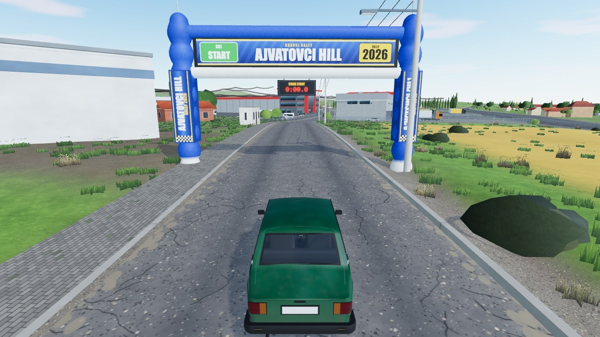
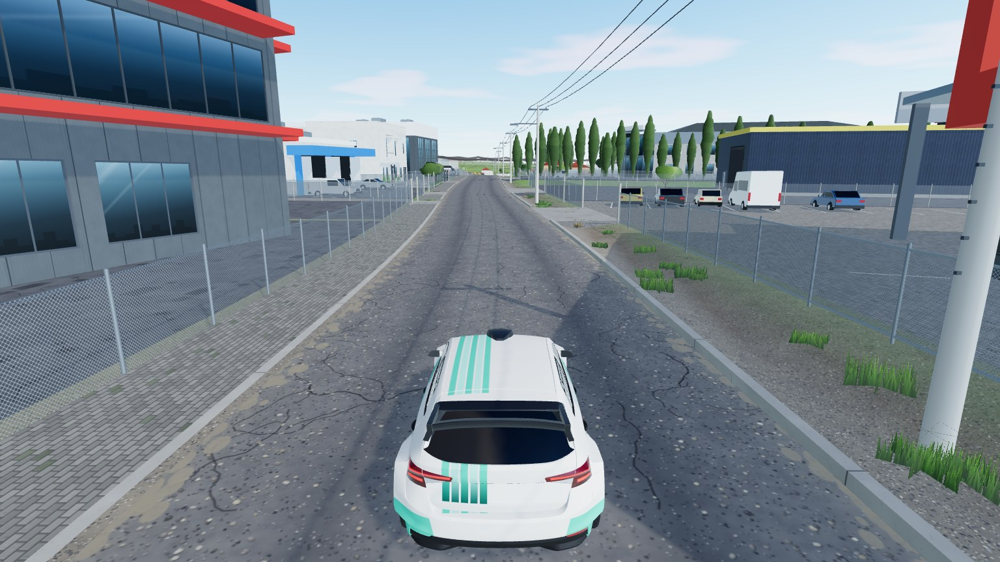
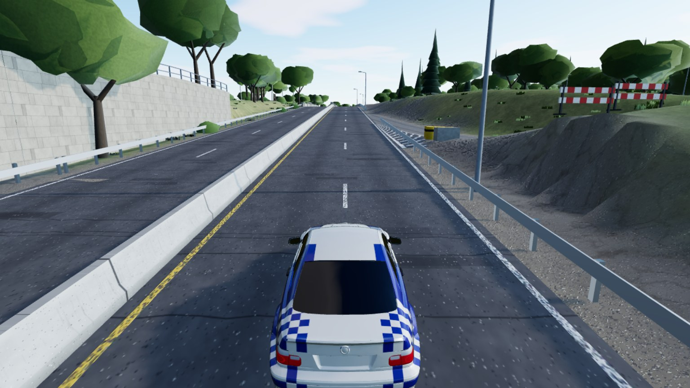
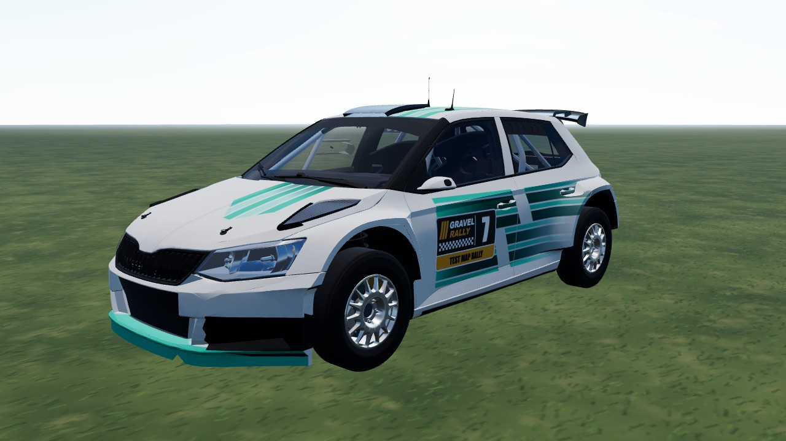
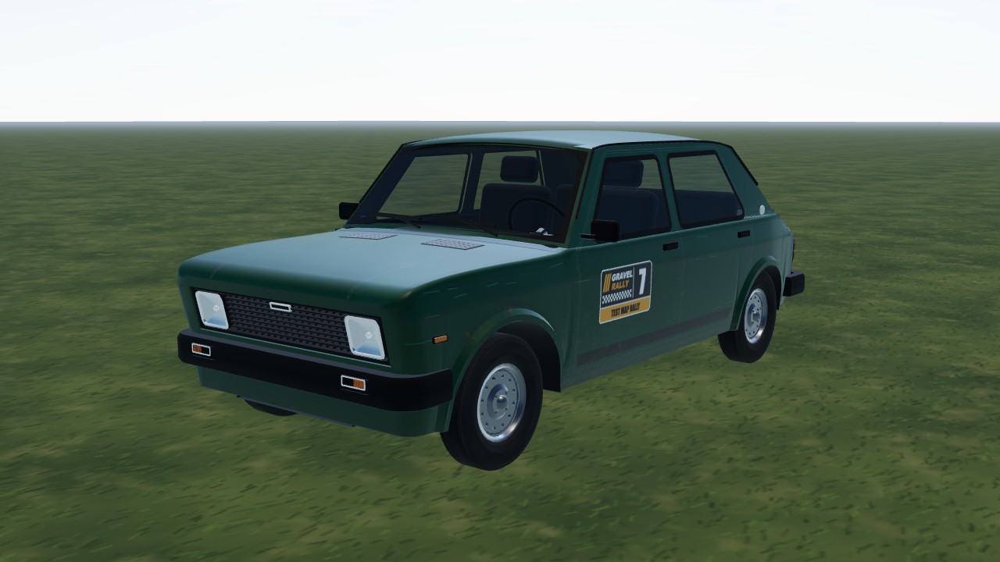

# Gravel Rally

Point-to-point gravel and tarmac rally on **real-world roads**: stages are baked from OpenStreetMap, ESA WorldCover and
elevation data, driven with a custom raycast-vehicle physics model. Built with three.js to learn the library, so the
look is "late-2000s rally game" and the feel is grounded sim-lite that is still fun on a keyboard.



## Play

```bash
npm run dev     # then open http://localhost:3000/games/rally/
```

Menu: select stage -> select car -> (optional) car set-up -> drive. Keyboard, gamepad and touch controls are supported.

| Keys                |                                                    |
| ------------------- | -------------------------------------------------- |
| `W` / `S`           | throttle / brake (hold `S` when stopped = reverse) |
| `A` / `D`           | steer                                              |
| `Space`             | handbrake                                          |
| `R`, `C`, `Esc`     | reset to road, camera, pause menu                  |
| `Q` / `E`, `G`, `T` | shift, manual gearbox, traction assist             |

## Features

- Real-world stages with bridges, junctions, buildings, power lines and city streets (see maps below).
- Seeded procedural vegetation, rocks and props through one instanced asset library, streamed terrain with LODs.
- Tyre compounds, tyre sizes, suspension and gearing set-ups per car, with a live 3D set-up screen.
- Stage timer with sectors, time penalties for cutting and knocking over marker posts, top-10 times per stage (stored
  locally).
- Tool pages: map viewer, car viewer, asset debugger (dev server).

## Stages

| Map                                     | Where                       | Length | Surface         | Status   |
| --------------------------------------- | --------------------------- | ------ | --------------- | -------- |
| [Petralica](maps/petralica/)            | North Macedonia (mountains) | 9.6 km | gravel + tarmac | playable |
| [Ajvatovci Hill](maps/ajvatovci/)       | Ilinden, North Macedonia    | 4.5 km | old tarmac      | playable |
| [Jackie Robinson Parkway](maps/jackie/) | New York City               | 7.3 km | tarmac, bridges | playable |
| [Test Map](maps/test/)                  | procedural forest           | 1.7 km | gravel          | physics  |

[](maps/ajvatovci/) [](maps/jackie/)

## Cars

| Car                              | Drive | Notes                                             |
| -------------------------------- | ----- | ------------------------------------------------- |
| [Skoda Rally](cars/skoda-rally/) | AWD   | Fabia R5 from a CC BY Sketchfab model, own livery |
| [Bimmer M3](cars/bimmer-m3/)     | RWD   | E46 coupe from a CC BY print STL                  |
| [Zastava 101](cars/zastava-101/) | FWD   | hand-built from a blueprint                       |

[](cars/skoda-rally/) [](cars/zastava-101/)

## Documentation

| Doc                         | Content                                                                                          |
| --------------------------- | ------------------------------------------------------------------------------------------------ |
| [`DETAILS.md`](DETAILS.md)  | pages and URLs, game / stage flow, map engine features, architecture, performance, set-up screen |
| [`PHYSICS.md`](PHYSICS.md)  | vehicle model, tuning guide, tyres and set-ups, test results                                     |
| `maps/<id>/`, `cars/<car>/` | per map / car: `README.md` (overview) and `DETAILS.md` (sources, licences, build notes)          |

## Credits

Map data: © OpenStreetMap contributors (ODbL), ESA WorldCover 2021 (CC BY 4.0), Copernicus DEM GLO-30, USGS 3DEP,
Microsoft building footprints. Car models and their licences: see each car's README and
[`THIRD-PARTY.md`](../../../THIRD-PARTY.md). Car makes and models are trademarks of their owners; this is a
non-commercial, educational fan project.
