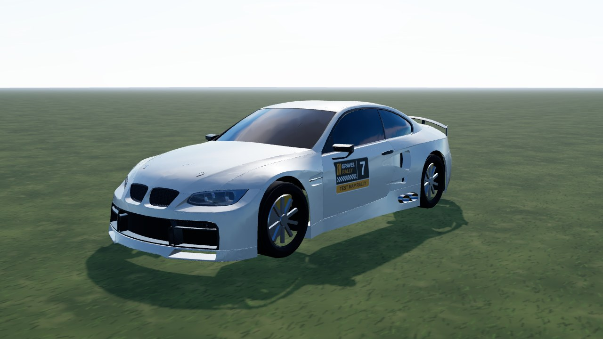
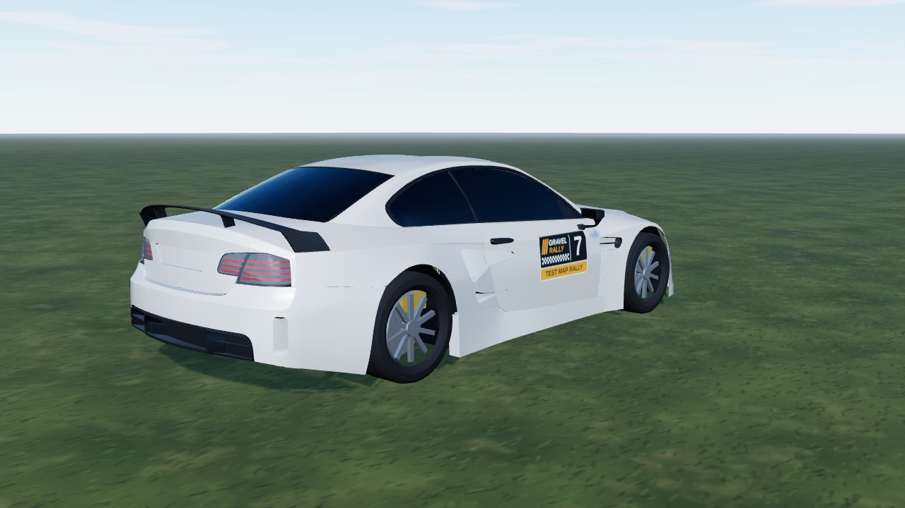
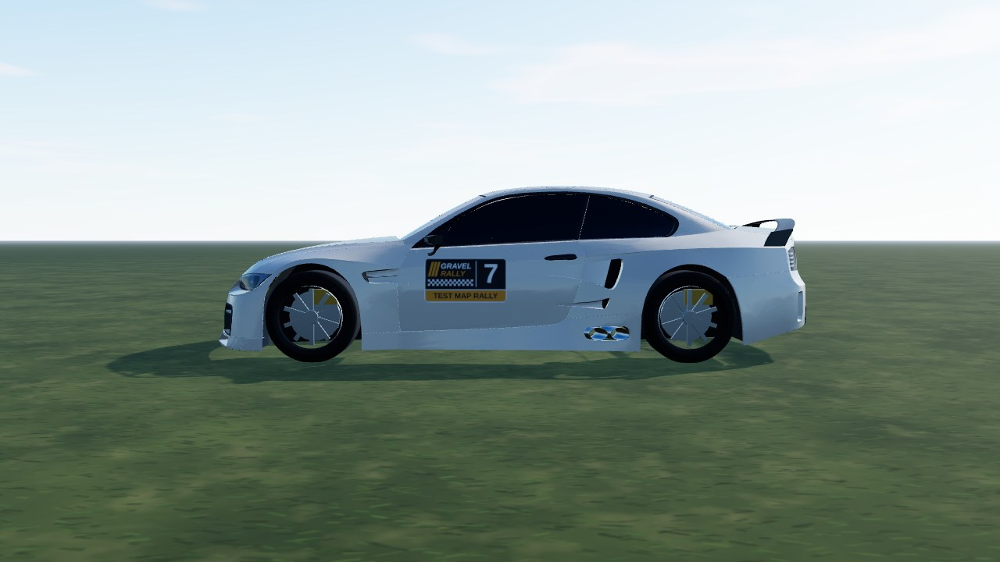

# Bimmer GT2 (`bimmer_gt2`)

A wide-body E92 M3 GT2-style racer (splitter, big wing, diffuser, side exhaust) converted from Tushar Singh's **CC BY** "E92 Barnfind"
Sketchfab model. The GLB already came split by material, so glass, lamps, kidneys, intakes, carbon parts and mirrors are separate parts;
the game draws its own wheels, brakes and tyres. In game it is **Bimmer GT2**, RWD V8, 1250 kg, 300/35 R18 race tyres (gravel 265/45 R17).
Clean base livery for now. **Test only** (`TEST_CARS` in `release.ts`).



|                                                |                               |
| ---------------------------------------------- | ----------------------------- |
|  |  |

```bash
npm run dev     # /games/rally/car-viewer.html?car=bimmer_gt2
```

## Files

| File                | What                                                                         |
| ------------------- | ---------------------------------------------------------------------------- |
| `bimmer-gt2.ts`     | `CarDef`: drivetrain, tyres, set-ups, body-fitted hull, fallback body, glTF  |
| `livery.ts`         | body atlas painter: base colour + dark undercoat                             |
| `model.source.json` | GLB material -> part mapping, scale / offset, atlas layout (read at runtime) |

The model file lives in `public/models/cars/bimmer_gt2.glb`; the raw download stays out of git (`sources/`, local only).

## Credits and licence

| What        | Source                                                                                                                     | Licence       |
| ----------- | -------------------------------------------------------------------------------------------------------------------------- | ------------- |
| Model (GLB) | ["E92 Barnfind" by Tushar Singh, Sketchfab](https://sketchfab.com/3d-models/e92-barnfind-550c4113c2a34b0693e9ee6e7773d840) | **CC BY 4.0** |

The converted model is a derivative (split, simplified, repainted). BMW and M3 are trademarks of BMW AG and only identify the car. The
model's roundel logos and number plate are removed, its Gulf-style rust paint is not used; the game paints its own livery. Code and
livery: [PolyForm Noncommercial 1.0.0](../../../../../LICENSE).
