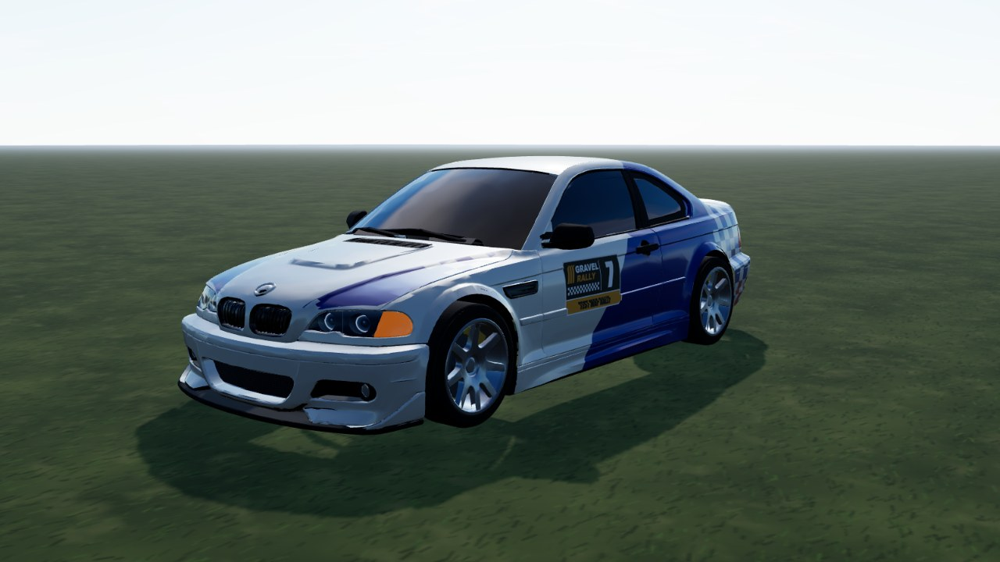
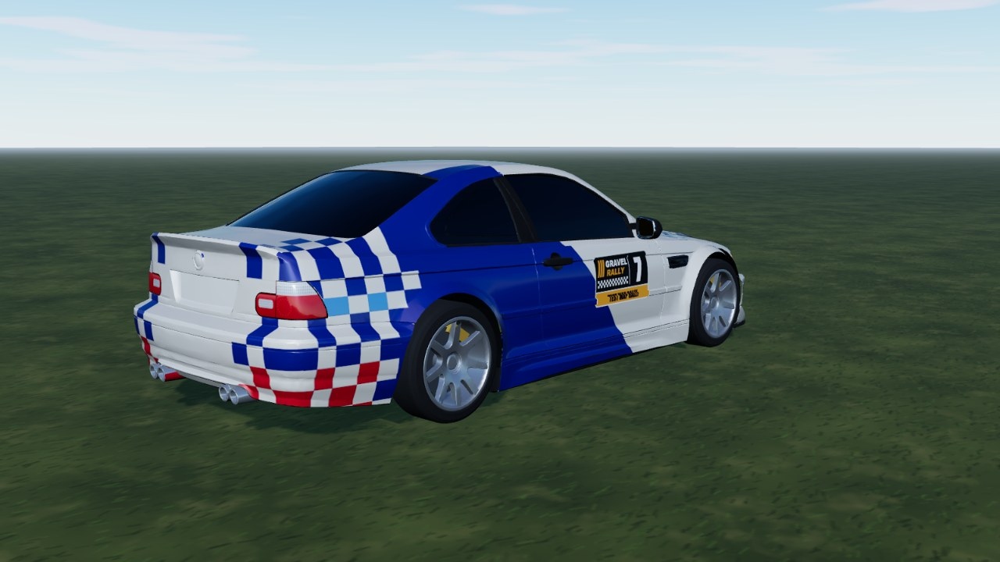
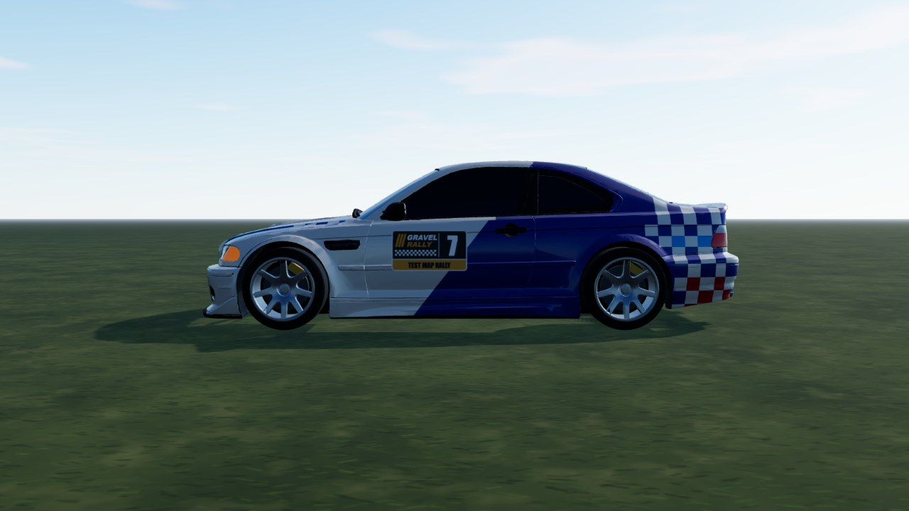

# Bimmer M3 (`bimmer_m3`)

A lowered E46 coupe (tuning / street version) converted from a **CC BY 1:33 print model**: one shell split into parts (glass, lamps,
kidneys, intakes, mirrors, exhaust, underbody, arch wells), the model's own 8-spoke rim under the game's tyres, and its lowered
street stance (floor 6.7 cm). In game it is **Bimmer M3**; the id stays `bimmer_m3`. RWD V8, 1180 kg, street wheels (245/40 R18,
gravel 205/65 R16). Wears the **M3 ALMS livery**, fitted to this body.
Released (`AVAILABLE_CARS`).



|                                                |                               |
| ---------------------------------------------- | ----------------------------- |
|  |  |

```bash
npm run dev     # /games/rally/car-viewer.html?car=bimmer_m3
```

## Stats (game engine configuration)

| Stat       | Value                                                                                  |
| ---------- | -------------------------------------------------------------------------------------- |
| Drivetrain | RWD, 6-speed, final drive 4.2 (short / medium / long set-ups on the setup screen)      |
| Engine     | V8, ~420 hp at 7600 rpm, 450 Nm peak, redline 8000 rpm                                 |
| Mass       | 1180 kg                                                                                |
| Wheels     | radius 0.33 m; tarmac / dusty tarmac 245/40 R18, gravel 205/65 R16                     |
| Top speed  | 249 km/h (6th at the redline)                                                          |
| 0-200 km/h | 10.6 s tarmac, 11.8 s dusty tarmac, 12.8 s gravel (does not reach 200 on loose gravel) |

| 0-100 km/h / 100-0 km/h | Tarmac         | Dusty tarmac   | Gravel        | Loose gravel  |
| ----------------------- | -------------- | -------------- | ------------- | ------------- |
| Tyre / set-up           | tarmac / stiff | mixed / medium | gravel / soft | gravel / soft |
| 0-100 km/h              | 3.3 s          | 4.3 s          | 4.8 s         | 6.0 s         |
| 100-0 km/h, full brake  | 32 m           | 42 m           | 42 m          | 48 m          |

Measured by the physics sim on flat ground (full throttle from standstill, traction control on, each surface on its
home tyre + set-up, 2026-10-04): `straight()` in `tests/rally/handling-harness.ts`. Top speed is the setup screen's number
(`topSpeed()` in `physics/gearing.ts`). Retune a car and these move - rerun and update.

## Files

| File                | What                                                                                                     |
| ------------------- | -------------------------------------------------------------------------------------------------------- |
| `bimmer-m3.ts`      | `CarDef`: RWD V8 drivetrain with this body's wheelbase / size / hull / street tyres, fallback body, glTF |
| `livery.ts`         | body atlas painter: the M3 ALMS livery, hood outline fitted to this mesh, matte black arch patch         |
| `model.source.json` | converter settings (axes, scale, offset, wheel cut, atlas) and `parts` (material picks)                  |

## Credits and licence

| What                             | Source                                                                                                                                                                                                                                                                                                                            | Licence                                                                                          |
| -------------------------------- | --------------------------------------------------------------------------------------------------------------------------------------------------------------------------------------------------------------------------------------------------------------------------------------------------------------------------------- | ------------------------------------------------------------------------------------------------ |
| Body + rims (STL)                | ["BMW E46 Coupe - Tuning - Model" by Doomas3D, MakerWorld](https://makerworld.com/en/models/2056872-bmw-e46-coupe-tuning-model)                                                                                                                                                                                                   | **CC BY 4.0** - attribution kept in `bimmer-m3.ts`, `THIRD-PARTY.md`, `public/models/CREDITS.md` |
| Parts split, conversion, physics | own work (`model.source.json`, `bimmer-m3.ts`)                                                                                                                                                                                                                                                                                    | project licence                                                                                  |
| Livery                           | M3 ALMS livery, own work (`livery.ts`)                                                                                                                                                                                                                                                                                            | project licence                                                                                  |
| Model + livery references        | [Top Gear](https://www.topgear.com/car-news/motorsport/e46-m3-gtr-would-be-ultimate-track-day-toy), [BMW M](https://www.bmw-m.com/en/topics/magazine-article-pool/bmw-m3-gtr-need-for-speed-most-wanted.html), [BimmerLife](https://bimmerlife.com/2026/08/11/the-m3-gtr-took-the-american-le-mans-series-by-storm-25-years-ago/) | articles, looked at only - nothing copied                                                        |

BMW and M3 are trademarks of BMW AG; the mesh's roundels are plain unpainted discs.

Tyres, suspension and gearing: [`PHYSICS.md`](../../PHYSICS.md).
