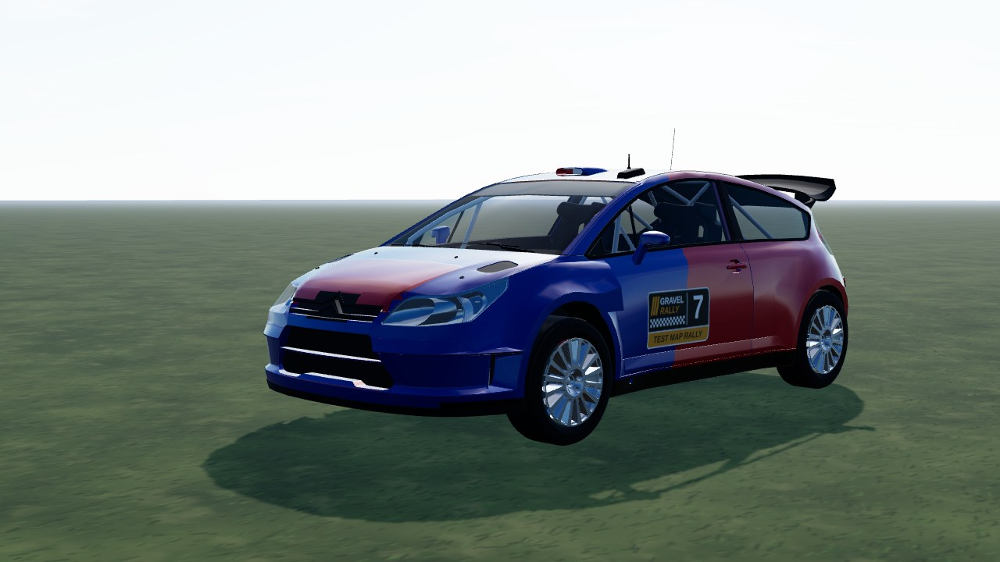
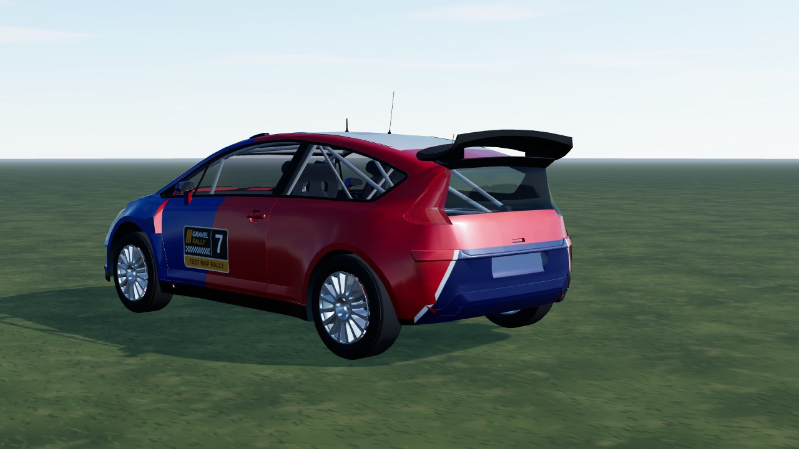
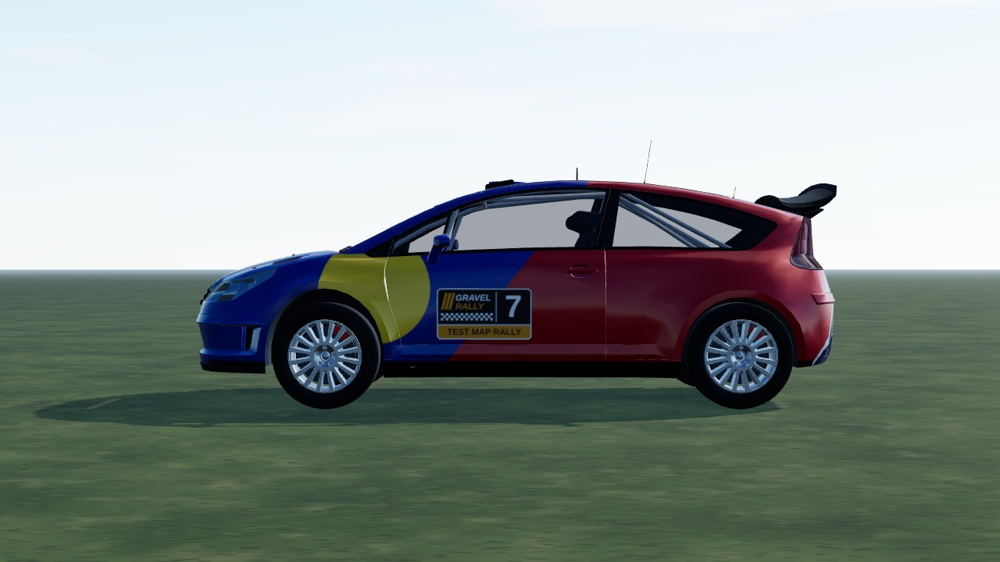

# Citroen C4 WRC (`citroen_c4`)

A 2007 World Rally Car from a **CC BY Sketchfab model**: the model's body, its **cockpit (seats, dash, roll cage) kept and visible
through the see-through glass**, its own 15-spoke rim **de-cambered and centred on the hub**, its own 3D headlamps and tail lamps,
and our own livery (white body, red lower flank under a navy line, navy bonnet stripe; shapes only, no logos). The sponsor
livery, the manufacturer chevrons on the grille, plate, brake discs and wheels of the source are dropped.
In game it is **Citroen C4 WRC**; the id stays `citroen_c4`. AWD, 1230 kg, 2.0 turbo. Test car (`TEST_CARS`, dev server only).



|                                                |                               |
| ---------------------------------------------- | ----------------------------- |
|  |  |

```bash
npm run dev     # /games/rally/car-viewer.html?car=citroen_c4
```

## Stats (game engine configuration)

| Stat       | Value                                                            |
| ---------- | ---------------------------------------------------------------- |
| Drivetrain | AWD, 6-speed sequential, final drive 4.6 (short / medium / long) |
| Engine     | 2.0 turbo four, 550 Nm / 315 hp, redline 6200 rpm                |
| Mass       | 1230 kg, wheelbase 2.615 m, track 1.62 m                         |
| Wheels     | radius 0.336 m; tarmac 235/45 R18, gravel 215/65 R15             |

## Files

| File                | What                                                                                       |
| ------------------- | ------------------------------------------------------------------------------------------ |
| `citroen-c4.ts`     | `CarDef`: physics, hull fitted to the model, rim, glass tint, glTF                         |
| `livery.ts`         | body atlas painter: the livery                                                             |
| `profile.ts`        | baked boxy side profile: fallback body and street car of the city maps                     |
| `model.source.json` | converter settings (offset, atlas) and `gltf` rules (material / node -> part, region cuts) |

## Credits and licence

| What                  | Source                                                                                                                                            | Licence        |
| --------------------- | ------------------------------------------------------------------------------------------------------------------------------------------------- | -------------- |
| Body, cockpit and rim | ["Citroen C4 WRC Red Bull 2007" by Max, Sketchfab](https://sketchfab.com/3d-models/citroen-c4-wrc-red-bull-2007-97d128fb4b2a4558a02d65af542486dc) | **CC BY 4.0**  |
| Specification         | [WRC.com](https://www.wrc.com/en/misc/citroen-c4-wrc), [Racecar Engineering](https://www.racecar-engineering.com/articles/citroen-c4-wrc-4/)      | reference only |

Converted and repainted by us (attribution in `CarDef.credit`, `THIRD-PARTY.md`, `public/models/CREDITS.md`). The downloaded GLB
itself is not in the repository (`sources/` is git-ignored); only the converted `citroen_c4.glb` / `citroen_c4_wheel.glb` ship.
Citroen and C4 are trademarks of their owner and only identify the car. Our code, livery and parts: PolyForm Noncommercial (root `LICENSE`).
