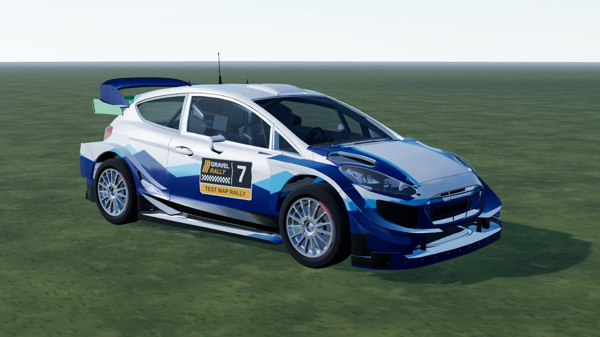
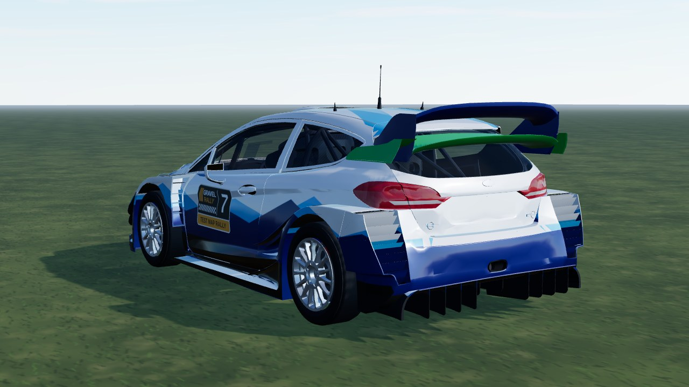
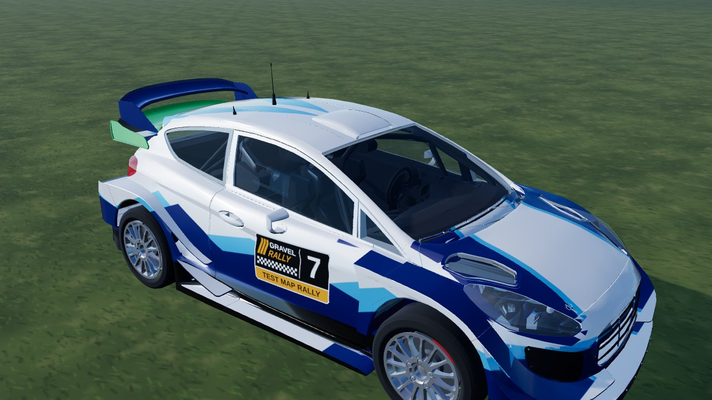

# Fiesta WRC (`fiesta`)

A 2017-spec World Rally Car from a **CC BY Sketchfab model**: the model's body, its **cockpit (seats, dash, roll cage) kept and visible
through the see-through glass**, its own 14-spoke rim **de-cambered and centred on the hub**, and our own livery (white body, navy and light-blue
mountain triangles on the sides, blue upper / green lower rear wing with matching end plates; shapes only, no logos). The manufacturer badge, plate, spare wheel and dash screens are dropped.
In game it is **Fiesta WRC**; the id stays `fiesta`. AWD, 1190 kg, 1.6 turbo. Test car (`TEST_CARS`, dev server only).



|                                                |                                     |
| ---------------------------------------------- | ----------------------------------- |
|  |  |

```bash
npm run dev     # /games/rally/car-viewer.html?car=fiesta
```

## Stats (game engine configuration)

| Stat       | Value                                                            |
| ---------- | ---------------------------------------------------------------- |
| Drivetrain | AWD, 5-speed sequential, final drive 4.6 (short / medium / long) |
| Engine     | 1.6 turbo four, ~430 Nm at 5000 rpm, redline 6900 rpm            |
| Mass       | 1190 kg, wheelbase 2.48 m, track 1.67 / 1.65 m                   |
| Wheels     | radius 0.325 m; tarmac 235/40 R18, gravel 215/65 R15             |

## Files

| File                | What                                                                                       |
| ------------------- | ------------------------------------------------------------------------------------------ |
| `fiesta.ts`         | `CarDef`: physics, hull fitted to the model, rim, glass tint, glTF                         |
| `livery.ts`         | body atlas painter: the livery                                                             |
| `model.source.json` | converter settings (offset, atlas) and `gltf` rules (material / node -> part, region cuts) |

## Credits and licence

| What                  | Source                                                                                                                                           | Licence        |
| --------------------- | ------------------------------------------------------------------------------------------------------------------------------------------------ | -------------- |
| Body, cockpit and rim | ["Ford Fiesta WRC" by kevin, Sketchfab](https://sketchfab.com/3d-models/ford-fiesta-wrc-8b3f0c6876c74c0480ca04e698582db3)                        | **CC BY 4.0**  |
| Specification         | [WRC.com](https://www.wrc.com/en/misc/m-sport-ford-fiesta-wrc), [Racecar Engineering](https://www.racecar-engineering.com/cars/ford-fiesta-wrc/) | reference only |

Converted and repainted by us (attribution in `CarDef.credit`, `THIRD-PARTY.md`, `public/models/CREDITS.md`). The downloaded GLB
itself is not in the repository (`sources/` is git-ignored); only the converted `fiesta.glb` / `fiesta_wheel.glb` ship. Ford and
Fiesta are trademarks of their owner and only identify the car. Our code, livery and parts: PolyForm Noncommercial (root `LICENSE`).
