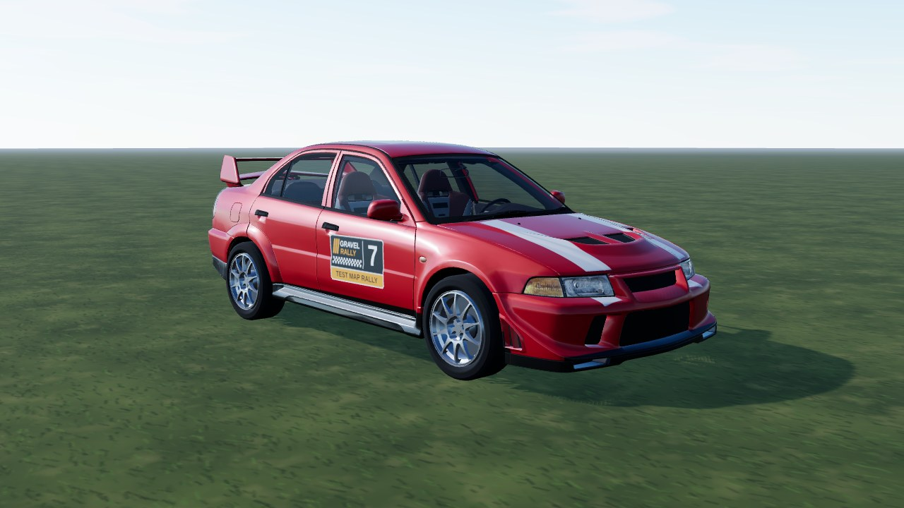
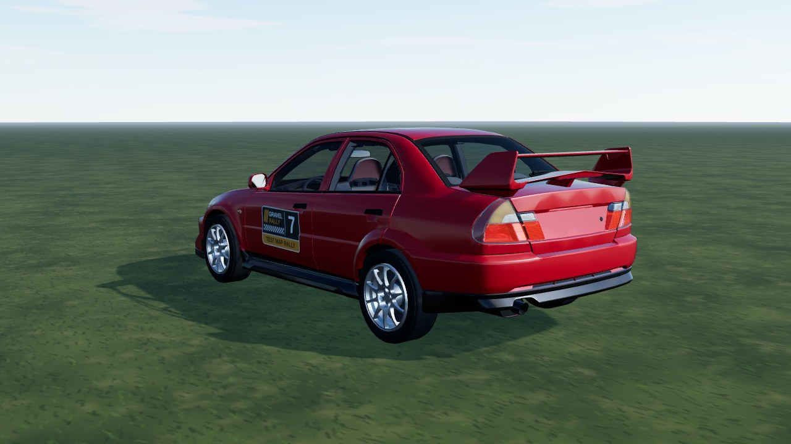
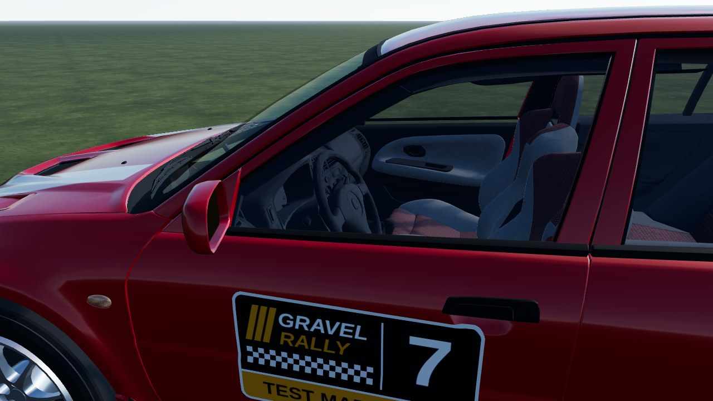

# Lancer EVO VI (`lancer_evo_6`)

A 1999-style rally Lancer from a **CC BY Sketchfab model**: the model's body, its **cockpit (seats with their own fabric, dash, wheel) kept and visible through
the see-through glass**, its own 10-spoke rim **de-cambered and centred on the hub**, its own 3D head / tail lamps **with their original lamp texture** (brake and reversing sections light up), and our own
livery (red with a white square in the middle of the roof, two white bonnet stripes, black skirts and bumper lips; shapes only, no logos or lettering). The manufacturer badges, plate, wheels,
tyres and brake parts of the source are dropped (the game draws its own). In game it is **Lancer EVO VI**. AWD, 1230 kg, 2.0 turbo,
300 hp. Test car (`TEST_CARS`, dev server only).



|                                                |                                     |
| ---------------------------------------------- | ----------------------------------- |
|  |  |

```bash
npm run dev     # /games/rally/car-viewer.html?car=lancer_evo_6
```

## Stats (game engine configuration)

| Stat       | Value                                                           |
| ---------- | --------------------------------------------------------------- |
| Drivetrain | AWD, 5-speed, final drive 4.6 (short / medium / long)           |
| Engine     | 2.0 turbo four, 500 Nm / 300 hp, redline 6800 rpm               |
| Mass       | 1230 kg, wheelbase 2.49 m, track 1.56 m                         |
| Wheels     | radius 0.316 m; tarmac 235/40 R18, gravel 205/60 R15            |
| Aids       | ABS, TC like every car (ABS can be switched off in the options) |

## Files

| File                | What                                                                                                                               |
| ------------------- | ---------------------------------------------------------------------------------------------------------------------------------- |
| `lancer-evo-6.ts`   | `CarDef`: physics, hull fitted to the model, rim, glass tint, glTF                                                                 |
| `profile.ts`        | boxy side profile baked from the GLB: fallback body and city street car (`side-profile.mjs`)                                       |
| `livery.ts`         | body atlas painter: the livery                                                                                                     |
| `model.source.json` | converter settings (offset, atlas), `gltf` rules (material / node -> part, island picks) and `srcParts` (textured lamps and seats) |

## Credits and licence

| What                                       | Source                                                                                                                                                                     | Licence        |
| ------------------------------------------ | -------------------------------------------------------------------------------------------------------------------------------------------------------------------------- | -------------- |
| Body, cockpit, rim, lamp and seat textures | ["Mitsubishi Lancer Evolution 6" by vecarz, Sketchfab](https://sketchfab.com/3d-models/mitsubishi-lancer-evolution-6-wwwvecarzcom-c3d5dcd8ff724bc88c46760d92fc5188)        | **CC BY 4.0**  |
| Specification                              | [RallyCars.com](https://rallycars.com/cars/mitsubishi-lancer-evolution-vi/history/), [Mitsubishi Motors](https://www.mitsubishi-motors.com/en/brand/motorsports/wrc/1999/) | reference only |

Converted and repainted by us (attribution in `CarDef.credit`, `THIRD-PARTY.md`, `public/models/CREDITS.md`). The downloaded GLB
itself is not in the repository (`sources/` is git-ignored); only the converted `lancer_evo_6.glb` / `lancer_evo_6_wheel.glb` and the model's lamp and seat textures (`lancer_evo_6_lamps.png`, `_seat`, `_fabric`, `_cab`) ship.
Mitsubishi and Lancer Evolution are trademarks of their owner and only identify the car. Our code, livery and parts: PolyForm
Noncommercial (root `LICENSE`).
