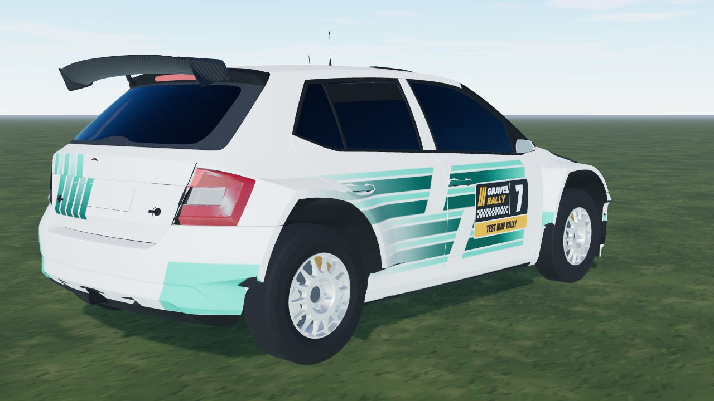
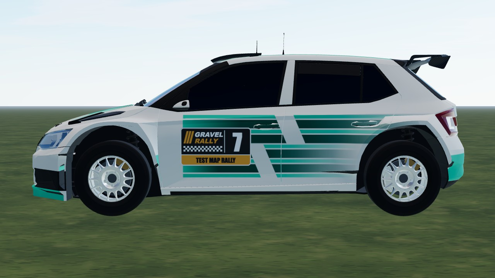

# Skoda Rally (`skoda_rally`)

The Fabia R5 (2015-19), the Rally2 class before it was called Rally2. The body is the CC BY "Skoda Fabia R5 Rally Car" model by SenturyUK, converted to the game
(`scripts/car-model/glb-to-parts-stl.py` + `stl-to-glb.mjs`, wheels and badges dropped, parts mapped to our materials) and
painted at runtime with our own white + green speed-stripe livery. A hand-built body (`blueprint.ts` / `body.ts`, traced from
Skoda's press dimensions) is the fallback when the GLB is missing. R5 package: 2.47 m wheelbase, 1.6 turbo with the restrictor, 5-speed sequential, mechanical diffs.


|                                                |                               |
| ---------------------------------------------- | ----------------------------- |
|  |  |

```bash
npm run dev     # /games/rally/car-viewer.html?car=skoda_rally
```

## Stats (game engine configuration)

| Stat       | Value                                                                                          |
| ---------- | ---------------------------------------------------------------------------------------------- |
| Drivetrain | AWD (42 % front), 5-speed, final drive 4.6 (short / medium / long set-ups on the setup screen) |
| Engine     | ~284 hp at 5500 rpm, 402 Nm peak, redline 6600 rpm                                             |
| Mass       | 1230 kg                                                                                        |
| Wheels     | radius 0.321 m; tarmac 235/40 R18, dusty tarmac / gravel 205/65 R15                            |
| Top speed  | 165 km/h (5th at the redline)                                                                  |

| 0-100 km/h / 100-0 km/h | Tarmac         | Dusty tarmac   | Gravel        | Loose gravel  |
| ----------------------- | -------------- | -------------- | ------------- | ------------- |
| Tyre / set-up           | tarmac / stiff | mixed / medium | gravel / soft | gravel / soft |
| 0-100 km/h              | 4.3 s          | 4.6 s          | 4.7 s         | 5.0 s         |
| 100-0 km/h, full brake  | 32 m           | 50 m           | 46 m          | 52 m          |

Measured by the physics sim on flat ground (full throttle from standstill, traction control on, each surface on its
home tyre + set-up, 2026-10-04): `straight()` in `tests/rally/handling-harness.ts`. Top speed is the setup screen's number
(`topSpeed()` in `physics/gearing.ts`). Retune a car and these move - rerun and update.

## Credits and licence

| What                                                           | Source                                                                                                                                           | Licence                          |
| -------------------------------------------------------------- | ------------------------------------------------------------------------------------------------------------------------------------------------ | -------------------------------- |
| Body model                                                     | ["Skoda Fabia R5 Rally Car" by SenturyUK (Sketchfab)](https://sketchfab.com/3d-models/skoda-fabia-r5-rally-car-fe062f0fd05e43a6a32a88a1aa39ef14) | CC BY 4.0 (converted, repainted) |
| Fallback body dimensions                                       | Skoda Auto press dimensions graphic (road Fabia); Skoda Motorsport press photos (rally car)                                                      | reference only, nothing shipped  |
| Car facts, press photos, wing / splitter / vents / scoop shape | [Skoda Motorsport - Fabia R5](https://www.skoda-motorsport.com/en/skoda-fabia-r5/)                                                               | press material, reference only   |
| Livery, parts, physics, code                                   | own work                                                                                                                                         | project licence                  |

The model's manufacturer badges are removed; no brand wordmarks or sponsor logos are painted. Skoda and Fabia are trademarks
of their owner and name the car only.

Measurements, conversion, checks and sources: [`DETAILS.md`](DETAILS.md). Open work: [`TODO.md`](TODO.md).
