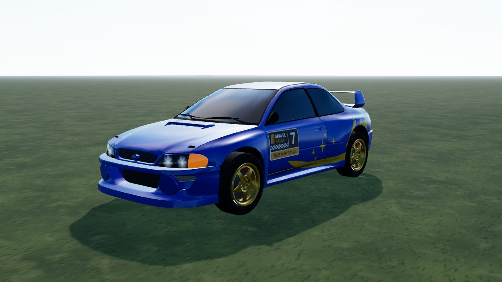
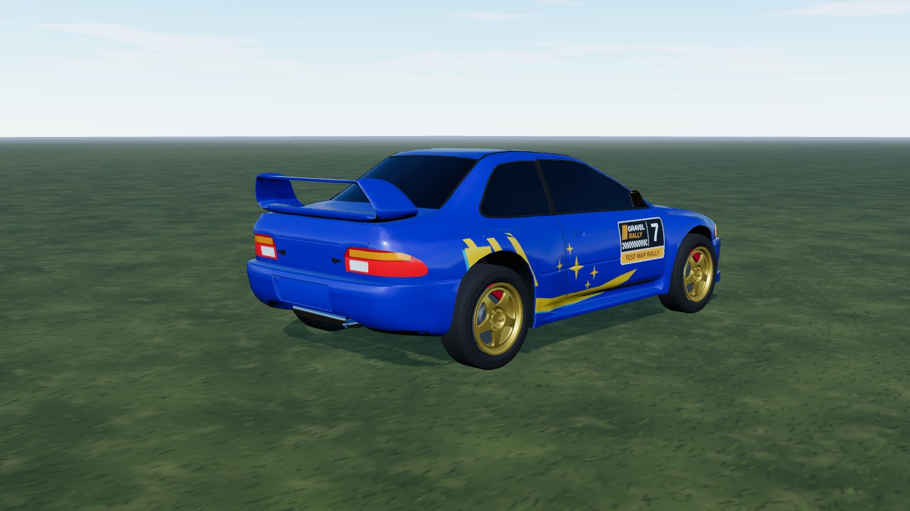
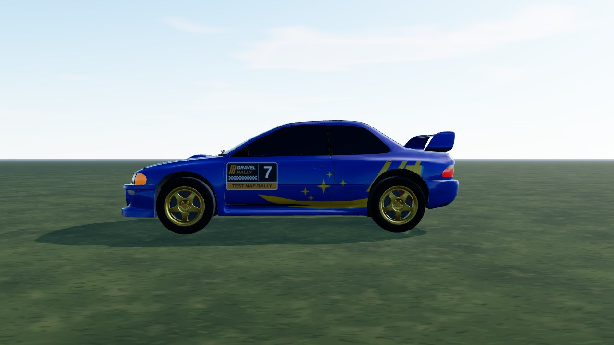

# Subaru WRX STI 22B (`subie_22b`)

A 1998 blue 22B coupe with the works side graphic: a yellow crescent, three rising streaks and a cluster of four-point stars
(generic shapes drawn at runtime, no logo or lettering). The body, glass and lamps are converted from Mateusz Woliński's **CC BY-NC**
"Subaru Impreza" Sketchfab model. Specs follow the 22B: 2.2 l turbo flat-four (~280 PS, 363 Nm), five-speed box, permanent AWD
with a rear bias, 1,270 kg ([STI](https://www.sti.jp/en/roadcars/1998/impreza-22b.html)). Wheels: the model's own gold alloy (`subie_22b_wheel.glb`, centred on the hub axis), fitted to the model's arches with a
235/45 R18 tyre (the real car runs 235/40 R17, track 1.48 / 1.50 m) and 215/60 R16 on gravel. Lamps: drawn headlight bowls
and a ribbed tail lamp with amber and reversing sections (`headlight22` / `tail22` in `part-materials.ts`). **Test only** (`TEST_CARS` in `release.ts`).



|                                                |                               |
| ---------------------------------------------- | ----------------------------- |
|  |  |

```bash
npm run dev     # /games/rally/car-viewer.html?car=subie_22b
```

## Files

| File                  | What                                                                                                                                 |
| --------------------- | ------------------------------------------------------------------------------------------------------------------------------------ |
| `subie-22b.ts`        | `CarDef`: drivetrain, tyres, set-ups, body-fitted hull, fallback body, glTF                                                          |
| `livery.ts`           | body atlas painter: blue base, dark undercoat, side star graphic                                                                     |
| `subie_22b_wheel.glb` | in `public/models/cars/`: rim + tyre cut from the model (`glb-wheel-extract.py --tyre auto`, `wheel-stl-to-glb.mjs --keep --barrel`) |
| `model.source.json`   | GLB material -> part mapping, scale / offset, atlas layout (read at runtime)                                                         |

The model lives in `public/models/cars/subie_22b.glb`; the raw download stays out of git (`sources/`, local only).

## Credits and licence

| What  | Source                                                                                                                              | Licence                  |
| ----- | ----------------------------------------------------------------------------------------------------------------------------------- | ------------------------ |
| Model | ["Subaru Impreza" by Mateusz Woliński](https://sketchfab.com/3d-models/subaru-impreza-7fb4298d5d8f4185b25bb2c43d7f3787) (Sketchfab) | CC BY-NC 4.0 (converted) |
| Specs | [STI Impreza 22B](https://www.sti.jp/en/roadcars/1998/impreza-22b.html)                                                             | looked at only           |

Code and the star graphic: PolyForm Noncommercial 1.0.0. The model's noncommercial licence is why this car must stay out of any
commercial fork.
