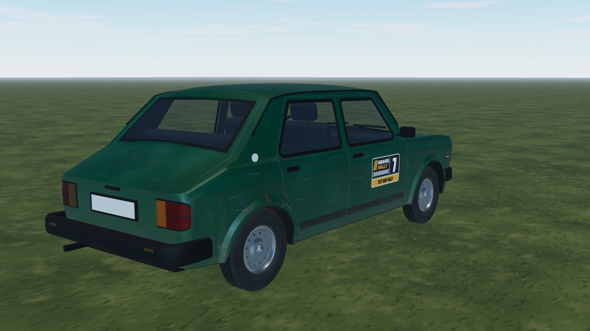
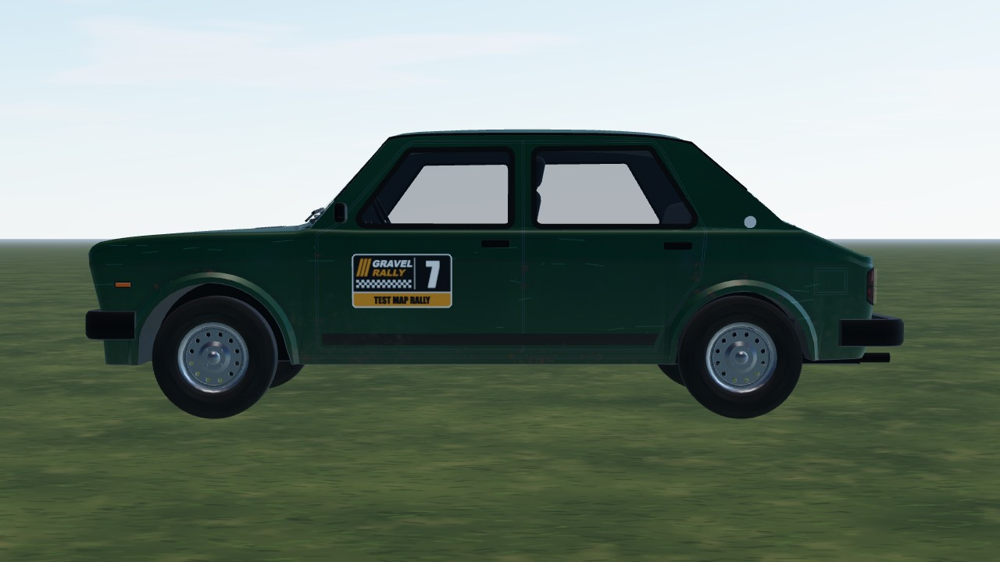

# Zastava 101 (`zastava_101`)

The 1970s Yugoslav "Stojadin": a light front-wheel-drive five-door with a mildly tuned 1.3 (about 85 hp), plated
differential and stock 145/80 R13 tyres, painted British racing green. The body is **hand-built in code** from
measured dimensions (`blueprint.ts` -> `body.ts`, no imported mesh): shark nose, body crease, flared arch lips, real
window openings, wrap-round lamps and a modelled cabin. The paint is a procedural atlas with panel gaps, rust and road
dirt. Light and slow, it wins on momentum and understeers if you are greedy.


|                                                |                               |
| ---------------------------------------------- | ----------------------------- |
|  |  |

```bash
npm run dev     # /games/rally/car-viewer.html?car=zastava_101
```

## Stats (game engine configuration)

| Stat       | Value                                                            |
| ---------- | ---------------------------------------------------------------- |
| Drivetrain | FWD, 5-speed, final drive 4.4, fixed gearing                     |
| Engine     | ~84 hp at 6500 rpm, 100 Nm peak, redline 7000 rpm                |
| Mass       | 870 kg                                                           |
| Wheels     | radius 0.285 m; 145/80 R13 on every surface                      |
| Top speed  | 160 km/h (drag-limited; 5th would reach 199 km/h at the redline) |

| 0-100 km/h / 100-0 km/h | Tarmac | Dusty tarmac | Gravel | Loose gravel |
| ----------------------- | ------ | ------------ | ------ | ------------ |
| 0-100 km/h              | 10.9 s | 11.4 s       | 11.8 s | 13.3 s       |
| 100-0 km/h, full brake  | 44 m   | 50 m         | 46 m   | 52 m         |

Measured by the physics sim on flat ground (full throttle from standstill, traction control on, each surface on its
home tyre + set-up, 2026-10-04): `straight()` in `tests/rally/handling-harness.ts`. Top speed is the setup screen's number
(`topSpeed()` in `physics/gearing.ts`). Retune a car and these move - rerun and update.

## Credits and licence

| What                        | Source                                                                                                                                               | Licence                  |
| --------------------------- | ---------------------------------------------------------------------------------------------------------------------------------------------------- | ------------------------ |
| Shape and styling reference | ["Zastava 101 (Stojadin)" by Tomislav Tomljenovic, Sketchfab](https://sketchfab.com/3d-models/zastava-101-stojadin-52c885cfc52a4ac1acb14f84a3feacfa) | CC BY 4.0 (no mesh used) |
| Outlines and dimensions     | a 4-view factory blueprint (outlines traced, dimensions measured);                                                                                   | public domain            |
| Body, paint, physics        | own work                                                                                                                                             | project licence          |

No brand wordmarks are modelled (plain grille bar, blank plate). Zastava is a trademark of its owner.

Measurements, build notes, sources and set-ups: [`DETAILS.md`](DETAILS.md). Open work: see
[`../../TASKS.md`](../../TASKS.md).
