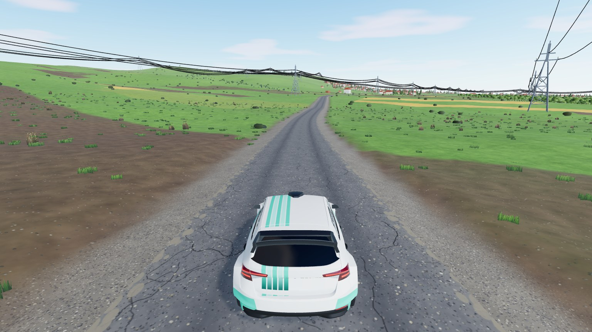
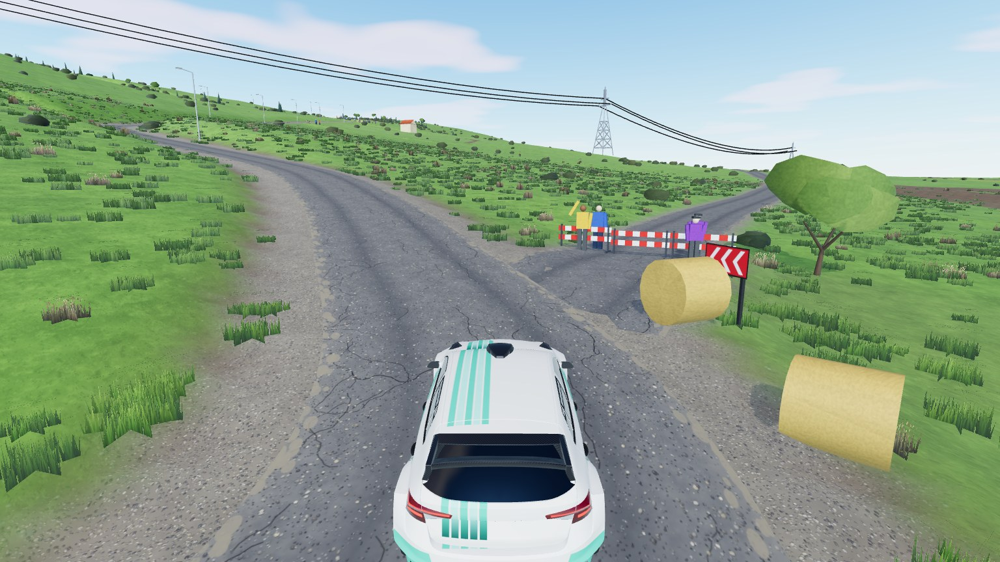

# Ajvatovci Hill

Real-world stage near Ilinden, North Macedonia: it starts in the Ilinden industrial zone beside the A2 motorway, crosses
the Aracinovo canal, follows a farmland road to Ajvatovci village and climbs the hill in switchbacks. 4.46 km of old,
narrow tarmac with a loose gravel film, in spring colours. Map id `ajvatovci`, stage 1.


|                                                 |                                         |
| ----------------------------------------------- | --------------------------------------- |
|  |  |
| the farmland road (orchards, power lines)       | switchbacks up Ajvatovci Hill           |

The first ~500 m, the **start street**, is hand-modelled: lots with real window and door openings, yards, fences,
kerbs, sidewalks, power poles and about 100 parked vehicles (`start-row/`); the car bounces off its kerbs and stops at fences. At the finish, the hilltop
church of St. Peter and St. Paul with its bell tower, and the village playground court on the way up, are hand-modelled
too ([`hilltop/`](hilltop/), `?spawn=church` / `?spawn=court`).

Around the stage, the map reaches over Ilinden town, the A2 and Marino (6.9 x 4.95 km of real roads, about 6 500
buildings, fields and drains) to explore in free drive.

```bash
npm run dev     # /games/rally/?map=ajvatovci&spawn=200      (drive from 200 m)
                # /games/rally/map-viewer.html?map=ajvatovci (fly around the whole map)
```

## Data and credits

| What                                         | Source                                                                                                                     | Licence                                                                          |
| -------------------------------------------- | -------------------------------------------------------------------------------------------------------------------------- | -------------------------------------------------------------------------------- |
| Stage route                                  | [Google Maps route (start -> Ajvatovci Hill)](https://www.google.com/maps/dir/42.0001365,21.5777226/42.0085904,21.6141518) | stage waypoints only                                                             |
| Roads, railways, land use, buildings, pylons | [OpenStreetMap](https://www.openstreetmap.org/copyright)                                                                   | ODbL, © OpenStreetMap contributors                                               |
| Building footprints (where OSM has none)     | [Microsoft Global ML Building Footprints](https://github.com/microsoft/GlobalMLBuildingFootprints)                         | ODbL                                                                             |
| Roads (where OSM has none)                   | [Microsoft ML Road Detections](https://github.com/microsoft/RoadDetections)                                                | ODbL, © Microsoft                                                                |
| Land cover                                   | [ESA WorldCover 2021](https://esa-worldcover.org/)                                                                         | CC BY 4.0                                                                        |
| Elevation                                    | [AWS Terrain Tiles](https://registry.opendata.aws/terrain-tiles/) (SRTM / EU-DEM based)                                    | [attributions](https://github.com/tilezen/joerd/blob/master/docs/attribution.md) |

The baked map files (`*.json`, `buildings.csv`, stage card) are a derived database of the ODbL sources above and stay under the ODbL (attribution +
share-alike). A few shapes (the orchard outline and the lot positions of the start street) were traced by eye from
satellite / street-level screenshots; no imagery is shipped. The start street's buildings are original models, not
copies of the real ones, and the company sign on one building belongs to a friend's company and is used with the owners' approval. The hilltop church, bell
tower and court are original procedural models made from reference photos (not shipped).
