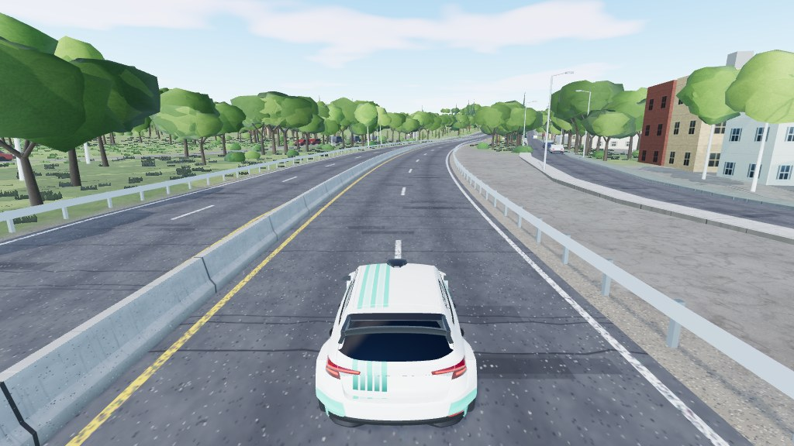

# Jackie Robinson Parkway

**Test map** (dev server only). Real-world stage on the Jackie Robinson Parkway in New York City: from East New York
(Brooklyn) north-east past Cypress Hills, Forest Park and the cemeteries to the Kew Gardens interchange in Queens.
7.3 km of narrow, winding, tree-lined 1930s parkway, driven on the eastbound carriageway, with the opposite
carriageway, ramps and interchange as ordinary side roads. Map id `jackie`, stage 3.


|                                                   |
| ------------------------------------------------- |
|  |

What makes it different from the village maps: bridges and under-passes, a concrete median and guard rails, city
streets with kerbs, sidewalks and crosswalks, sheer retaining-wall cuts, and about 7,800 mesh buildings extruded from
OpenStreetMap footprints and heights.

```bash
npm run dev     # /games/rally/?map=jackie&spawn=1000
                # /games/rally/map-viewer.html?map=jackie
```

## Data and credits

| What                                   | Source                                                                                                                                                                                   | Licence                                                                          |
| -------------------------------------- | ---------------------------------------------------------------------------------------------------------------------------------------------------------------------------------------- | -------------------------------------------------------------------------------- |
| Stage route                            | [Google Maps route (Vermont St -> Jackie Robinson Pkwy -> Kew Gardens)](https://www.google.com/maps/dir/40.6808527,-73.8963462/Jackie+Robinson+Pkwy,+New+York,+NY/40.714605,-73.8298097) | stage waypoints only                                                             |
| Roads, bridges, buildings with heights | [OpenStreetMap](https://www.openstreetmap.org/copyright) via Overpass                                                                                                                    | ODbL, © OpenStreetMap contributors                                               |
| Terrain (5 m bare-earth lidar)         | [USGS 3D Elevation Program](https://www.usgs.gov/3d-elevation-program)                                                                                                                   | US public domain, credit USGS 3DEP                                               |
| Horizon terrain                        | [AWS Terrain Tiles](https://registry.opendata.aws/terrain-tiles/)                                                                                                                        | [attributions](https://github.com/tilezen/joerd/blob/master/docs/attribution.md) |
| Land cover (woods, grass)              | [ESA WorldCover 2021](https://esa-worldcover.org/)                                                                                                                                       | CC BY 4.0                                                                        |

The baked `data.json` is a derived database of OpenStreetMap and stays under the ODbL. The emergency vehicles carry short
generic lettering ("POLICE", "FIRE DEPT", "AMBULANCE") and no logos or badges.

Full source list, bake notes and the game-side city features: [`DETAILS.md`](DETAILS.md). Open work: [`TODO.md`](TODO.md).
