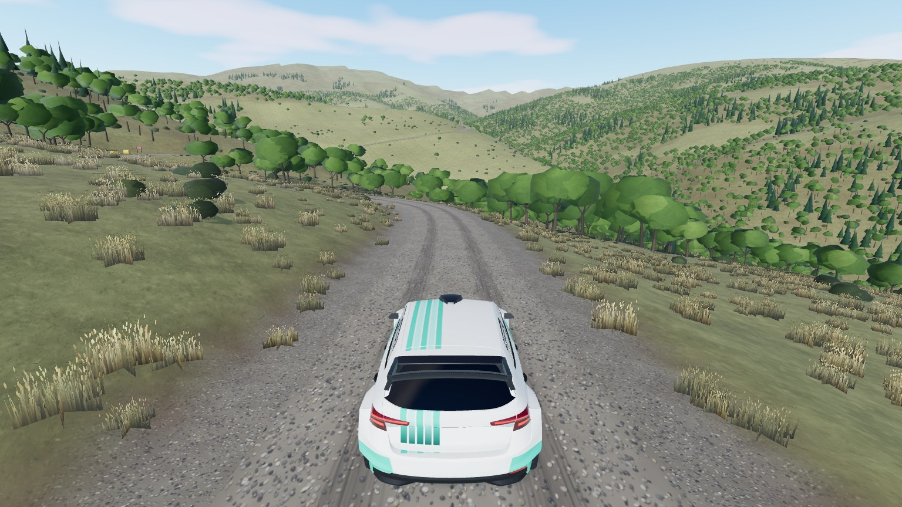
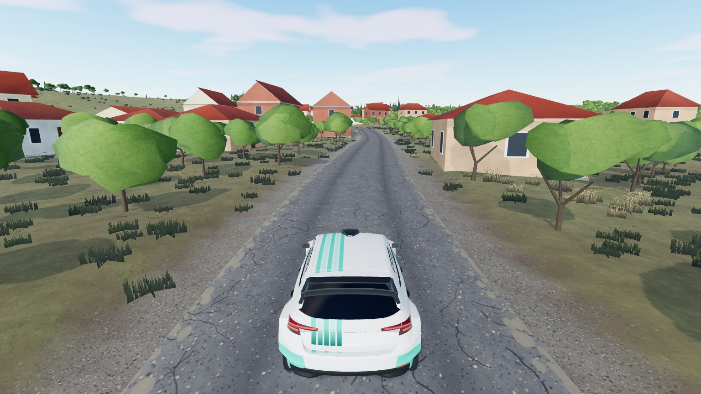

# Petralica

Real-world mountain stage in Rankovce municipality, north-east North Macedonia: from Ginovci village across the E-871 road, up the valley on a
straight road through fields to Petralica village, then a twisty climb through oak woods and open pasture to "Vila
Ristovski". 9.64 km, 478 m -> 1040 m above sea level, asphalt first and gravel from about 4.8 km. Map id `petralica`,
stage 2.



|                                                        |
| ------------------------------------------------------ |
|  |

Most of the route is real OpenStreetMap road. Two parts that OSM does not have (about 1 km above Petralica and the
last 1.1 km) were traced from a route screenshot and are only accurate to 10-25 m, and the houses are generated on
land that is marked as built-up, so their number and sizes are approximate.

```bash
npm run dev     # /games/rally/?map=petralica&spawn=7500
                # /games/rally/map-viewer.html?map=petralica
```

## Data and credits

| What                | Source                                                                                                                       | Licence                                                                                                                             |
| ------------------- | ---------------------------------------------------------------------------------------------------------------------------- | ----------------------------------------------------------------------------------------------------------------------------------- |
| Stage route         | [Google Maps route (Ginovci -> Vila Ristovski)](https://www.google.com/maps/dir/42.1707824,22.1691664/42.2401682,22.2009501) | stage waypoints; two missing road parts traced from a screenshot of it                                                              |
| Roads, water, woods | [OpenStreetMap](https://www.openstreetmap.org/copyright)                                                                     | ODbL, © OpenStreetMap contributors                                                                                                  |
| Extra tracks        | [Microsoft ML Road Detections](https://github.com/microsoft/RoadDetections)                                                  | ODbL, © Microsoft                                                                                                                   |
| Elevation           | [Copernicus DEM GLO-30](https://doi.org/10.5069/G9028PQB) via OpenTopography                                                 | Copernicus licence, © DLR e.V. 2010-2014 and © Airbus Defence and Space GmbH 2014-2018, provided under COPERNICUS by the EU and ESA |
| Horizon terrain     | [AWS Terrain Tiles](https://registry.opendata.aws/terrain-tiles/)                                                            | [attributions](https://github.com/tilezen/joerd/blob/master/docs/attribution.md)                                                    |
| Land cover          | [ESA WorldCover 2021](https://esa-worldcover.org/)                                                                           | CC BY 4.0                                                                                                                           |

The baked map files (`*.json`, `buildings.csv`, stage card) are a derived database of OpenStreetMap and stay under the ODbL. Dataset citation: European Space
Agency (2024). Copernicus Global Digital Elevation Model. Distributed by OpenTopography.
https://doi.org/10.5069/G9028PQB.
