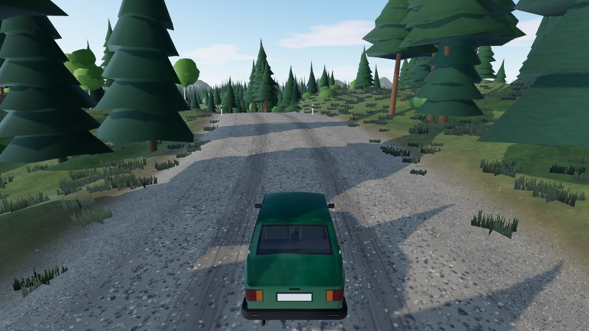

# Test Map

Procedural ~1.7 km forest gravel stage for physics work: fast sweepers, S-bends, hairpin, crest jump, flat test
pad (`?spawn=pad`). Everything is generated from `map.ts` (noise terrain, hand-placed road points, scatter rules).

| File        | What                                    |
| ----------- | --------------------------------------- |
| `map.ts`    | the whole map (pure data)               |
| `README.md` | this file - external links / files used |

## External sources

None - fully procedural (seed 1337), so there is no `sources/maps/test/` folder. If reference photos, textures or
data are ever used for this map, put the files in `sources/maps/test/` and add a row:

| Link / file | Used for | Licence / attribution | Added |
| ----------- | -------- | --------------------- | ----- |
| -           | -        | -                     | -     |

## Tools

| Tool       | Link                                                  |
| ---------- | ----------------------------------------------------- |
| Map viewer | `/games/rally/map-viewer.html?map=test`               |
| Play       | `/games/rally/?map=test&spawn=start` (or `spawn=pad`) |
